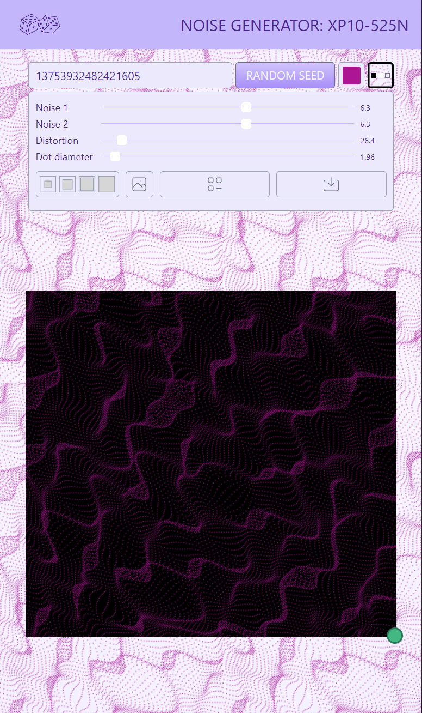
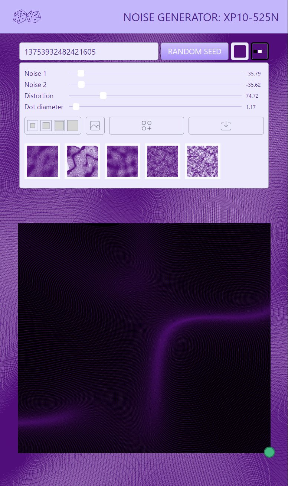

#### About

Noise generator with web worker and OffscreenCanvas. So far, only Chromium browsers.

Noise generator: XP10-525N (as "Experimental 21.05.25 Noise").

<!--  -->

#### Credits, References, Links

* This app was inspired by [@iamnottheway](https://twitter.com/iamnottheway) [noise generator](https://noiseisnice.com)
* [Background Patterns, Simplified by Conic Gradients](https://css-tricks.com/background-patterns-simplified-by-conic-gradients/)
* [Lea Verou - CSS3 Patterns Gallery](https://projects.verou.me/css3patterns/)
* [React cool dimensions](https://react-cool-dimensions.netlify.app/)
* [Sliders from Password Generator](codepen.io/maxzz/pen/LYZJmbb) [by Sikriti Dakua](https://codepen.io/dev_loop/pen/vYYxvbz)
