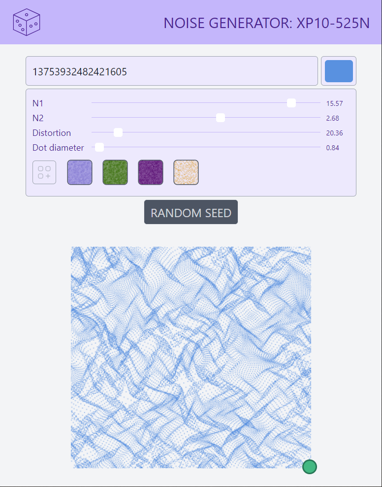

#### Anout

Noise with web workers play. Noise generator: xp10-525N (as experimental 21.05.25 Noise).

#### Credits, references, links

* [Nice noise](https://noiseisnice.com)
* [Background Patterns, Simplified by Conic Gradients](https://css-tricks.com/background-patterns-simplified-by-conic-gradients/)
* [Lea Verou - CSS3 Patterns Gallery](https://projects.verou.me/css3patterns/)
* [React cool dimensions](https://react-cool-dimensions.netlify.app/)
* [Sliders from Password Generator](codepen.io/maxzz/pen/LYZJmbb) [by Sikriti Dakua](https://codepen.io/dev_loop/pen/vYYxvbz)
