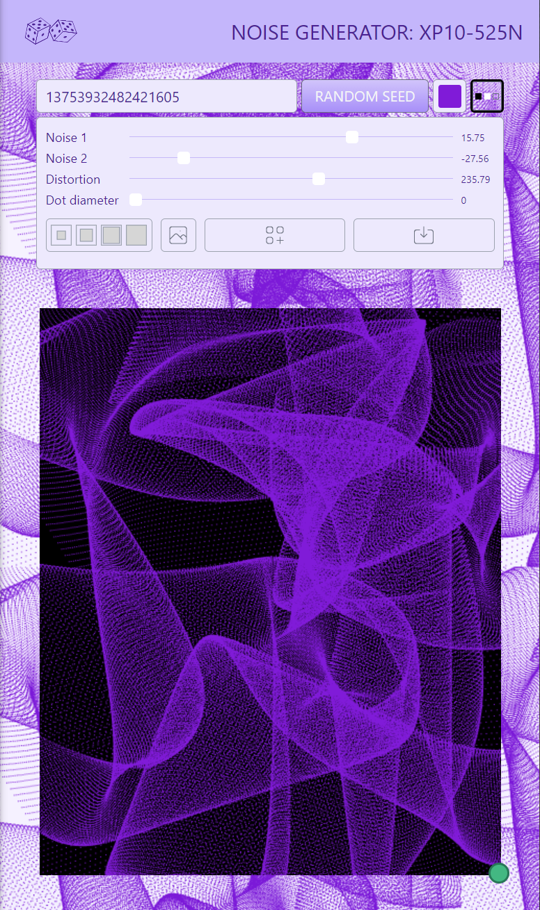

#### About

Noise generator with web worker and OffscreenCanvas. So far, only Chromium browsers.

Noise generator: XP10-525N (as "Experimental 21.05.25 Noise").

<!--  -->

#### Project roadmap

    [ ] Main controls
        [x] Allow user-specified seeds and random seeds.
        [x] Noise generator sliders.
        [x] Allow to generate ramdom preset (except the color). (button animation?)
        [ ] Generated presets history.
        [ ] Round values to two decimal places.
    [ ] Additional controls
        [x] Allow the user to select the color of pixels on the canvas.
        [x] Allow to change the background of the rendering canvas: bkack, white, and transparent.
        [x] Predefined image sizes (squere): 25%, 50%, 75%, 100%.
        [x] Allow choose noise: noise2D, noise3D, noise4D.
        [x] Let the user change noise type and scale.
        [x] Add current preset to presets.
        [x] Download image as PNG.
        [ ] Allow the user to customize the predefined image sizes.
        [x] Let the user choose the size of the generated texture to save.
            [x] Popup with the size of the exported image.
                [x] Handle the case when the image size is over 2000 x 2000, which is too much for Chrome.
                [x] Show the maximum allowed image size.
            [x] Save the user-defined size of the exported image to the config.
            [ ] Show the save progress indicator.
            [ ] Add show/hide animation to popup.
    [x] App controls
        [x] Set the currnent canvas image as the page background.
        [x] Allow to clear the page background from the canvas image.
    [ ] Features
        [x] Add persistance of the current generated parameters.
        [x] Persist the user defined presets.
            [x] Generate missing or predefined previews.
        [ ] Add predefined presets (that exist always).
        [ ] Drag and Drop canvas image to the existing preset slot.
        [ ] Progress bar on slow reders.
        [ ] Smooth UI state changes to show what has changed.
        [-] Create seamless textures using 4x4 algorithm. Out of scope. Not for now.
        [ ] Support Firefox rendering.

#### Credits, References, Links

* This app was inspired by [@iamnottheway](https://twitter.com/iamnottheway) [noise generator](https://noiseisnice.com)
* [Background Patterns, Simplified by Conic Gradients](https://css-tricks.com/background-patterns-simplified-by-conic-gradients/)
* [Lea Verou - CSS3 Patterns Gallery](https://projects.verou.me/css3patterns/)
* [React cool dimensions](https://react-cool-dimensions.netlify.app/)
* [Sliders from Password Generator](codepen.io/maxzz/pen/LYZJmbb) [by Sikriti Dakua](https://codepen.io/dev_loop/pen/vYYxvbz)
